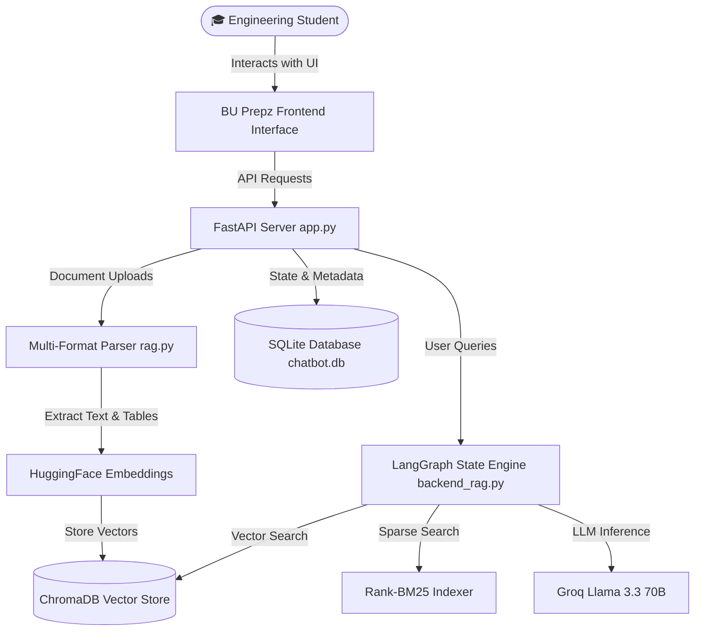

<div align="center">

#  BU Prepz AI Workspace
### *Next-Gen Engineering Study Assistant & Document Intelligence Platform*

[](https://fastapi.tiangolo.com/)
[](https://python.org)
[](https://langchain-ai.github.io/langgraph/)
[](https://www.trychroma.com/)
[](https://groq.com/)
[](LICENSE)

</div>

---

## 🌟 Overview

**BU Prepz AI Workspace** is an intelligent, high-performance study platform designed specifically for engineering students. Built with **FastAPI**, **LangGraph**, and **ChromaDB**, BU Prepz enables instant multi-format document search, automated Past Year Question (PYQ) exam paper generation, in-browser Word document previews, and personal private study compartmentalization.

---

##  Key Features

###  Multi-Format RAG Search Engine (`.pdf`, `.docx`, `.doc`)
- Universal document parsing supporting **PDFs**, **DOCX**, and binary **DOC** files.
- Extracts text, paragraph structures, and tabular data into a dense vector space using `sentence-transformers/all-mpnet-base-v2`.
- Powered by a **Hybrid Retrieval Engine** combining ChromaDB vector similarity with BM25 sparse keyword matching.

### 🔒 Dual-Scope Workspace (My Library vs. Community Catalog)
- **Personal Library**: Private study space isolated exclusively for your uploaded assignments, notes, and documents.
- **Shared Catalog**: Collaborative university resource hub where students share open notes, past papers, and study material.

###  In-Browser Document Reader
- Native HTML document reader rendered on-the-fly for Word files (`.docx`, `.doc`).
- Renders formatted typography, structured data tables, and metadata tags with zero client-side dependencies.

###  Predictive PYQ & Exam Question Generator
- AI-driven frequency analysis over past question papers.
- Generates mock exam papers categorized by subject, semester, and exam type (Mid-Sem / End-Sem) with probability scoring.

### 💬 LangGraph Agentic Workflow
- Multi-turn stateful conversational agent with dynamic tool routing.
- Integrated thread memory persistence with SQLite (WAL mode for concurrent access).

###  Gamified Analytics & Leaderboard
- Real-time study streak counters and upload contribution tracking.
- Interactive student leaderboard celebrating top contributors.

---

## 🏗️ System Architecture



---

##  Tech Stack

| Domain | Technologies Used |
| :--- | :--- |
| **Backend & Routing** | Python 3.10+, FastAPI, Uvicorn |
| **AI Orchestration** | LangGraph, LangChain Core, LangChain Community |
| **Large Language Model** | Groq Llama 3.3 70B (`llama-3.3-70b-versatile`) |
| **Embeddings & Search** | HuggingFace (`all-mpnet-base-v2`), ChromaDB, Rank-BM25 |
| **Document Processing** | PyPDF, Python-Docx, HTML Text Extraction |
| **Database** | SQLite3 (WAL Mode for Concurrent Read/Write) |
| **Frontend UI** | HTML5, Modern CSS3 (Glassmorphism), Vanilla ES6 JS |

---

##  Project Structure

```text
prepz-workspace/
├── app.py                 # Core FastAPI application server & API endpoints
├── backend_rag.py         # LangGraph state machine & multi-turn agent logic
├── rag.py                 # PDF/DOCX text extraction & ChromaDB vector indexing
├── database.py            # SQLite database schema, user profiles & upload metadata
├── tools.py               # Auxiliary AI tools (Calculator, Search, Time)
├── static/                # Frontend web client
│   ├── index.html         # Main dashboard layout
│   ├── style.css          # Glassmorphic design system & typography
│   └── app.js             # Client-side state & UI event dispatcher
├── uploads/               # Document storage directory
├── Dockerfile             # Container definition
├── Procfile               # Cloud application entrypoint
└── requirements.txt       # Production python dependencies
```

---

##  Quick Start (Local Setup)

### 1. Clone the Repository
```bash
git clone https://github.com/om0710/prepz-workspace-.git
cd prepz-workspace-
```

### 2. Environment Setup
```bash
python3 -m venv venv
source venv/bin/activate
pip install -r requirements.txt
```

### 3. Configure API Key
Create a `.env` file in the root directory:
```env
GROQ_API_KEY=your_groq_api_key_here
```

### 4. Start the Application
```bash
python app.py
```
Visit `http://localhost:7865` in your browser.

---

## ‍ Author & Acknowledgements

Developed with  by **Om Bansal**

- **GitHub**: [@om0710](https://github.com/om0710)
- **LinkedIn**: [Om Bansal](https://www.linkedin.com/in/om-bansal-78420430a/)

---

<div align="center">
  <sub>Built for Engineering Students. Distributed under the MIT License.</sub>
</div>
